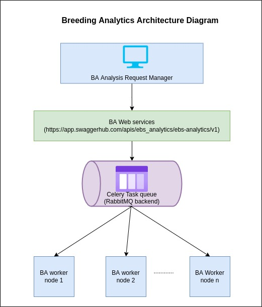

# Enterprise Breeding Analytics Framework

## Componenets 

### Analysis Request Manager(ARM):

Web application to serve as user interface for submitting analysis requests to Analytics Framework.

[ARM UI Repo](https://bitbucket.org/ebsproject/arm-ui/)

### BA Web services:

Backend Web services that process the analysis requests and acts as a producer for analytics queue.
Can accept requests for below two kind of data sources,

1. EBS (EBS RESTful Webservices)
2. BRAPI (RESTful webservices that follows BRAPI spcification)

[Webservice Documentation](https://app.swaggerhub.com/apis/ebs_analytics/ebs-analytics/v1)

### BA Analysis Workers:

Asynchoronous workers to process analysis requests using engines specified in the analysis config selected
by the user.

