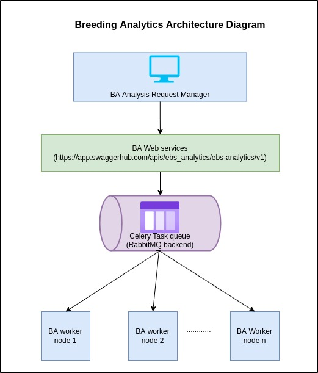

# Enterprise Breeding Analytics Framework

## Componenets 

### Analysis Request Manager(ARM):

Web application to serve as user interface for submitting analysis requests to Analytics Framework.

[ARM UI Repo](https://bitbucket.org/ebsproject/arm-ui/)

### BA Web services:

Backend Web services that process the analysis requests and acts as a producer for analytics queue.
Can accept requests for below two kind of data sources,

1. EBS (EBS RESTful Webservices)
2. BRAPI (RESTful webservices that follows BRAPI spcification)

[Webservice Documentation](https://app.swaggerhub.com/apis/ebs_analytics/ebs-analytics/v1)

### BA Analysis Workers:

Asynchoronous workers to process analysis requests using engines specified in the analysis config selected
by the user.

### G-Crunch

To run with G-Crunch, the UI needs to be run, and pointed at this instance either manually or via config. See the G-Crunch UI readme for more.

For simple G-Crunch installation - edit the example '.env' file to include your requirements, then docker compose build on this folder, then docker compose run to get a simple, testable environment. Of course, to get multiple worker nodes, or to separate features across different systems, check the docker compose and run something like docker-swarm. All the nessisary communication paths are listed in the docker-compose (there's a lot of database access).

Warning - the postgres password may not take effect. docker exec -it <database's address> bash  then sudo psql -U <user> then ALTER USER <> WITH PASSWORD <>   to force it. I'll try to figure out why the script didn't stick later -JDLS